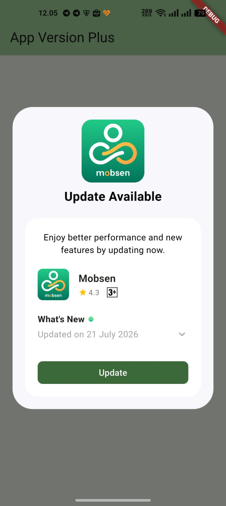
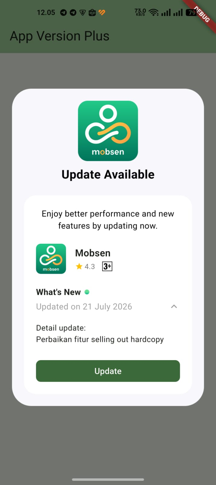

# app_version_plus

[](https://pub.dev/packages/app_version_plus)
[](https://pub.dev/packages/app_version_plus/score)
[](https://pub.dev/packages/app_version_plus/score)
[](https://github.com/adampermana/app_version_plus/stargazers)
[](https://github.com/adampermana/app_version_plus/network)

A comprehensive Flutter plugin for checking app version updates across **Android (Play Store)**, **iOS (App Store)**, and **Huawei (AppGallery)** — with built-in support for **Android In-App Updates** via Google Play Core.

## ✨ Features

- ✅ **Multi-Platform Support** — Android, iOS, and Huawei AppGallery
- ✅ **Android In-App Updates** — Immediate and Flexible update flows via Google Play Core
- ✅ **Auto Device Detection** — Automatically detects Huawei devices
- ✅ **Two Usage Modes** — Ready-to-use UI widget or function-only for custom UI
- ✅ **Rich Store Information** — Version, release notes, ratings, downloads, app icon, and more
- ✅ **Customizable** — Full control over UI and behavior
- ✅ **Type-Safe** — Full Dart null-safety support
- ✅ **Auto Fallback** — Falls back to Play Store URL if In-App Update is unavailable

## 📸 Screenshots

| Showcase 1 | Showcase 2 |
|---|---|
|  |  |

## Supported Platforms

| Platform | Version Check | In-App Update |
|---|---|---|
| Android | ✅ Play Store scraping | ✅ Google Play Core |
| iOS | ✅ iTunes Lookup API | — (opens App Store) |
| Huawei | ✅ APKPure scraping | — (direct APK download) |

## 📦 Installation

Add to your `pubspec.yaml`:

```yaml
dependencies:
  app_version_plus: ^0.1.0
```

Then run:

```bash
flutter pub get
```

## 🚀 Quick Start

### Option 1: Ready-to-Use UI (Simplest)

```dart
import 'package:app_version_plus/app_version_plus.dart';

final checker = AppVersionChecker(
  androidId: 'com.example.app',
  iOSId: 'com.example.app',
);

final versionInfo = await checker.checkForUpdate();

if (versionInfo != null && versionInfo.canUpdate) {
  showDialog(
    context: context,
    barrierDismissible: false,
    builder: (context) => VersionUpdateDialog(
      versionInfo: versionInfo,
      cancelButtonText: 'Later',
    ),
  );
}
```

On Android, tapping **Update** automatically triggers the Play Core In-App Update flow. On iOS it opens the App Store. On Huawei it downloads the APK directly.

### Option 2: Custom UI (More Control)

```dart
final checker = AppVersionChecker();
final versionInfo = await checker.checkForUpdate();

if (versionInfo != null && versionInfo.canUpdate) {
  print('Current: ${versionInfo.localVersion}');
  print('Latest:  ${versionInfo.storeVersion}');

  // Build your own UI, then trigger the update:
  await checker.launchStore(versionInfo: versionInfo);
}
```

## 📖 Configuration

### AppVersionChecker Parameters

```dart
final checker = AppVersionChecker(
  // App IDs for each store (defaults to current package name)
  androidId: 'com.example.app',
  iOSId: 'com.example.app',
  huaweiId: 'com.example.app',

  // Store locale / country
  androidPlayStoreCountry: 'id_ID',
  iOSAppStoreCountry: 'ID',

  // Release notes format
  androidHtmlReleaseNotes: false,
  huaweiHtmlReleaseNotes: false,

  // Android In-App Update type (Android only)
  // AndroidUpdateType.immediate — fullscreen blocking, user must update before continuing
  // AndroidUpdateType.flexible — background download, user stays in app (default: immediate)
  androidUpdateType: AndroidUpdateType.immediate,

  // Override device type for testing
  overrideDeviceType: DeviceType.android,

  // Force a version string for testing
  forceAppVersion: '2.0.0',
);
```

### Android In-App Update Types

| Type | Behavior | Best For |
|---|---|---|
| `immediate` | Fullscreen overlay, user must update | Critical fixes, breaking changes |
| `flexible` | Download in background, user keeps using app | Non-critical updates |

```dart
// Immediate update (default)
AppVersionChecker(androidUpdateType: AndroidUpdateType.immediate)

// Flexible update — user stays in app while downloading
AppVersionChecker(androidUpdateType: AndroidUpdateType.flexible)
```

For flexible updates, when the download finishes, a snackbar appears automatically prompting the user to restart and apply the update.

## 📊 Version Information

The `VersionInfo` object provides rich data from the store:

```dart
final versionInfo = await checker.checkForUpdate();

// Version comparison
versionInfo.canUpdate         // bool
versionInfo.updateAvailability // UpdateAvailability enum
versionInfo.isMajorUpdate     // bool
versionInfo.isMinorUpdate     // bool
versionInfo.isPatchUpdate     // bool

// Update flow config (Android)
versionInfo.androidUpdateType // AndroidUpdateType

// App metadata
versionInfo.appName           // String?
versionInfo.developerName     // String?
versionInfo.appIconUrl        // String?
versionInfo.rating            // double? (1.0–5.0)
versionInfo.ratingCount       // int?
versionInfo.downloadCount     // String? (Android/Huawei only)
versionInfo.ageRating         // String?
versionInfo.releaseNotes      // String?
versionInfo.lastUpdateDate    // DateTime?
versionInfo.appStoreLink      // String
```

## 🎨 Dialog Customization

```dart
VersionUpdateDialog(
  versionInfo: versionInfo,

  // Text
  title: 'Update Tersedia',
  message: 'Versi baru tersedia! Silakan update sekarang.',
  updateButtonText: 'Update Sekarang',
  cancelButtonText: 'Nanti',       // omit to hide cancel button
  whatsNewLabel: "What's New",
  
  // Date formatting
  dateFormat: 'd MMMM yyyy',
  dateLocale: 'id',

  // Update button style
  updateButtonColor: Colors.green,
  updateButtonGradient: LinearGradient(
    colors: [Colors.green, Colors.teal],
  ),

  // Cancel button style
  cancelButtonColor: Colors.grey,

  // Layout
  showReleaseNotes: true,
  barrierDismissible: false,
  backgroundColor: Colors.white,
)
```

## 🔧 Advanced Usage

### Force Update (Cannot Dismiss)

```dart
showDialog(
  context: context,
  barrierDismissible: false,
  builder: (context) => VersionUpdateDialog(
    versionInfo: versionInfo,
    barrierDismissible: false, // no cancel button, no back gesture
  ),
);
```

### Manual Device Override (Testing)

```dart
// Test Huawei flow on a non-Huawei device
final checker = AppVersionChecker(
  overrideDeviceType: DeviceType.huawei,
  huaweiId: 'com.example.app',
);
```

### Cache Control

```dart
// Bypass cache and fetch fresh data
final versionInfo = await checker.checkForUpdate(forceRefresh: true);

// Clear all cached data
checker.clearCache();
```

### Using InAppUpdateService Directly

For custom update UIs on Android:

```dart
import 'package:app_version_plus/app_version_plus.dart';

final service = InAppUpdateService(
  onFlexibleUpdateDownloaded: () {
    // Show your own prompt, then call:
    service.completeFlexibleUpdate();
  },
);

// Check availability
final info = await service.checkUpdateAvailability();
if (info != null && info.hasUpdate) {
  await service.startImmediateUpdate();
  // or
  await service.startFlexibleUpdate();
}
```

## 🔧 Platform-Specific Notes

### Android (Play Store)

- Version info fetched via Play Store scraping
- **In-App Updates** powered by Google Play Core — requires the app to be installed from Google Play (Internal Testing track or higher)
- If In-App Update is unavailable (sideloaded APK, emulator without Play Services), the dialog automatically falls back to opening the Play Store URL

### iOS (App Store)

- Uses the official iTunes Lookup API — more reliable than scraping
- Tapping Update opens the App Store listing
- No download count available from Apple

### Huawei (AppGallery)

- Auto-detected on Huawei/Honor devices via `device_info_plus`
- Version info fetched via APKPure scraping
- Tapping Update triggers a direct APK download

## ❓ FAQ

**Q: Do In-App Updates work on emulators?**
A: Only if the emulator has Google Play Services and the app is installed from the Play Store. Use Internal Testing track for testing.

**Q: What happens if the user is not on Google Play?**
A: The dialog detects this automatically and falls back to opening the Play Store URL — no crash, no extra configuration needed.

**Q: Can I use flexible and immediate for different update severities?**
A: Yes. Check `versionInfo.isMajorUpdate` and pass the appropriate `androidUpdateType` to `AppVersionChecker`.

**Q: How does Huawei detection work?**
A: `device_info_plus` reads the device manufacturer. If it matches "huawei" or "honor", AppGallery/APKPure flow is used instead of Play Store.

**Q: Can I force an update so the user cannot skip?**
A: Yes — use `AndroidUpdateType.immediate` on Android (Play Core blocks the UI), or set `barrierDismissible: false` and omit `cancelButtonText` in the dialog for iOS/Huawei.

**Q: Does this work offline?**
A: No — an internet connection is required to check the store and to fetch update info.

## 🔧 Troubleshooting

### Getting `ERROR_API_NOT_AVAILABLE` error

Be aware that this plugin cannot be tested locally. It must be installed via Google Play to work. Please check the official documentation about In-App Updates from Google:

- [Android In-App Updates Overview](https://developer.android.com/guide/app-bundle/in-app-updates)
- [How to Test In-App Updates](https://developer.android.com/guide/playcore/in-app-updates/test)

## 🤝 Contributing

Contributions are welcome! Feel free to open an issue or submit a pull request on [GitHub](https://github.com/adampermana/app_version_plus).

## 📄 License

Licensed under the MIT License — see the [LICENSE](LICENSE) file for details.
